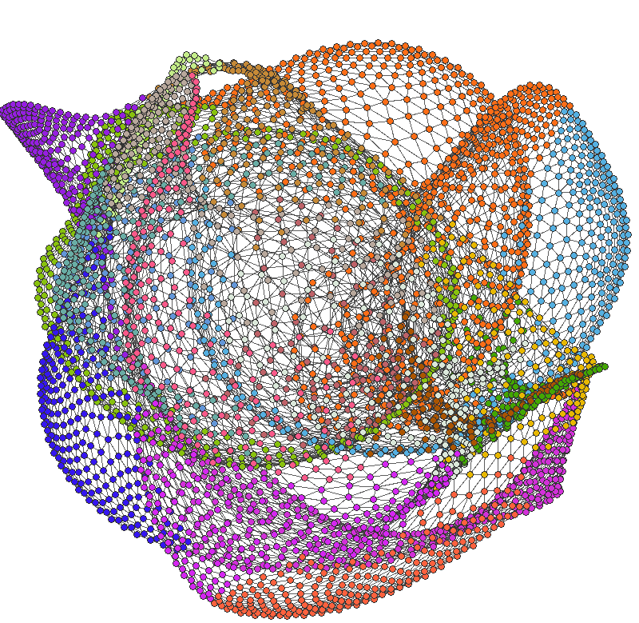

# Visualization and analysis of complex networks.

	

## This project implements four algorithms:
1. layout computing of a graph using the spring-electrical model [1]
2. previous algorithm improved by fast approximation via octree [2]
3. a greedy algorithm for community detection [3]
4. Louvain's algorithm for community detection [4]

[1] Thomas M. J. Fruchterman and Edward M. Reingold. Graph drawing by force-directed placement. Softw., Pract.
Exper. , 21(11):11291164, 1991.

[2] Yifan Hu. Ecient, high-quality force-directed graph drawing. The Mathematica Journal , 10(1), 2006.

[3] M. E. J. Newman. Fast algorithm for detecting community structure in networks. Phys. Rev. E , 69:066133, 2004. 

[4] Vincent D Blondel, Jean-Loup Guillaume, Renaud Lambiotte, and Etienne Lefebvre. Fast unfolding of commu-
nities in large networks. Journal of Statistical Mechanics: Theory and Experiment , 2008, 2008.
