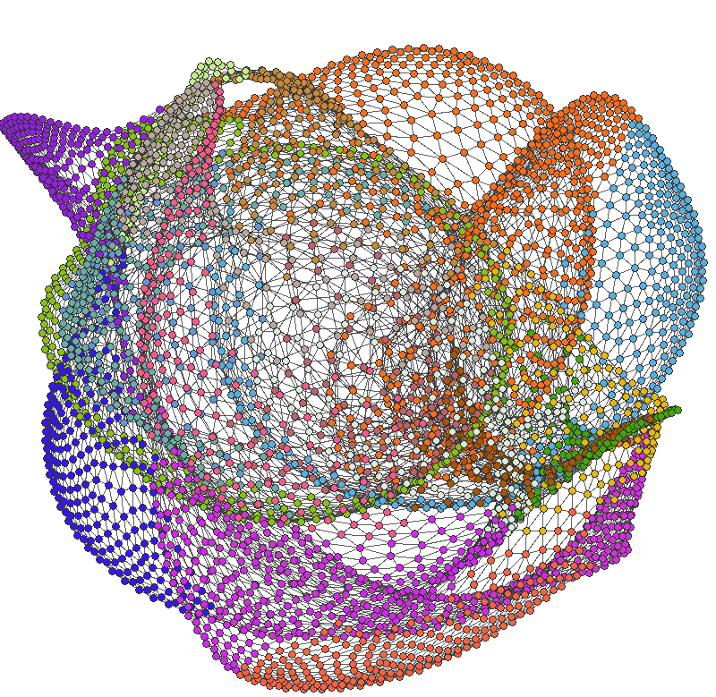

# Visualization and analysis of complex networks.

	

This project implements four algorithms:
* layout computing of a graph using the spring-electrical model [1]
* previous algorithm improved by fast approximation via octree [2]
* a greedy algorithm for community detection [3]
* Louvain's algorithm for community detection [4]

